# HORUS Framework

<div align="center">

[](https://github.com/softmata/horus/releases) [](https://www.rust-lang.org/) [](https://www.python.org/) [](LICENSE) [](https://docs.horus-registry.dev/getting-started/installation) [](#performance) [](#performance)

**Hybrid Optimized Robotics Unified System**

A production-grade robotics framework built in Rust for **real-time performance** and **memory safety**. HORUS delivers sub-microsecond IPC latency (50-500x faster than ROS2) while maintaining a simpler developer experience.

[](https://docs.horus-registry.dev) [](https://docs.horus-registry.dev/getting-started/installation) [](https://docs.horus-registry.dev/performance/performance) [](https://discord.gg/hEZC3ev2Nf)

</div>

---

> [!IMPORTANT]
> **Having issues?** If something breaks while using HORUS, please [create an issue](https://github.com/softmata/horus/issues) on GitHub. We appreciate your feedback and will help resolve problems quickly.

---

## Why HORUS?

**Coming from ROS/ROS2?** HORUS provides the same multi-process architecture with **significantly better performance** and **memory safety guarantees**. Perfect for hard real-time control, safety-critical systems, and edge robotics.

**New to robotics?** HORUS's simple CLI and single-file project support gets you from zero to working robot code in minutes, not hours.

### vs ROS2

| Feature | HORUS | ROS2 |
|---------|-------|------|
| **Message Latency** | Sub-microsecond (87ns - 262ns) | 50μs - 500μs |
| **Memory Safety** | Rust (zero-cost) | C++ (manual) |
| **Getting Started** | 1 command | 10+ commands + config files |
| **IPC Mechanism** | Wait-free & lock-free shared memory | DDS middleware |
| **Real-time Control** | Native priority scheduling | Executor model |
| **Learning Curve** | Gentle | Steep |

**When to use HORUS:**
- Hard real-time control (<1ms loops)
- Safety-critical systems
- Edge/embedded robotics
- New projects wanting modern tooling
- Teams valuing simplicity and performance
- Deterministic debugging: Logs include `tick_number` (same every run) to identify execution points across runs

## Built-in Hardware Nodes - Ready for Production

HORUS includes **32 production-ready nodes** with hardware drivers integrated. Unlike ROS2 which requires installing separate packages, HORUS is **batteries included** - start building robots immediately.

### Comprehensive Node Library

| Category | Nodes | Hardware Support |
|----------|-------|------------------|
| **Sensors** | Camera, Depth Camera (RealSense), LiDAR, IMU, GPS, Encoder, Ultrasonic, Force/Torque | Hardware drivers |
| **Actuators** | DC Motor, BLDC Motor (ESC), Stepper, Servo, Dynamixel, Roboclaw | GPIO, PWM, Serial protocols |
| **Safety** | Battery Monitor (I2C), Safety Monitor, Emergency Stop | Production-grade safety features |
| **Communication** | CAN Bus, Modbus, Serial/UART, I2C, SPI, Digital I/O | Industrial protocols |
| **Navigation** | Odometry, Localization, Path Planner, Collision Detector | Differential drive, mecanum, ackermann |
| **Control** | PID Controller, Differential Drive | Real-time control loops |

### Example: Autonomous Robot with Built-in Nodes

Built-in nodes connect via **topics** - just like ROS, but simpler. Here's a complete obstacle-avoiding robot:


```rust
use horus::prelude::*;
use horus_library::prelude::*;

fn main() -> Result<()> {
    let mut scheduler = Scheduler::new();

    // SAFETY (Priority 0) - Always runs first
    scheduler.add(Box::new(EmergencyStopNode::new("cmd_vel")?), 0, Some(true));

    // SENSOR (Priority 1) - LiDAR publishes to "lidar/scan"
    let mut lidar = LidarNode::new()?;
    lidar.configure_serial("/dev/ttyUSB0", 115200);
    scheduler.add(Box::new(lidar), 1, Some(true));

    // PERCEPTION (Priority 2) - Subscribes "lidar/scan", publishes "obstacles"
    let mut detector = CollisionDetectorNode::new()?;
    detector.set_safety_distance(0.5);  // 50cm
    scheduler.add(Box::new(detector), 2, Some(true));

    // PLANNING (Priority 3) - Subscribes "obstacles", publishes "cmd_vel"
    scheduler.add(Box::new(PathPlannerNode::new()?), 3, Some(true));

    // CONTROL (Priority 4) - Subscribes "cmd_vel", publishes "motor/*"
    let drive = DifferentialDriveNode::new("cmd_vel", "motor/left", "motor/right", 0.3)?;
    scheduler.add(Box::new(drive), 4, Some(true));

    // ACTUATORS (Priority 5) - Subscribe to motor commands
    let mut left = BldcMotorNode::new()?;
    left.configure_gpio(12, EscProtocol::DShot600);
    left.set_input_topic("motor/left");
    scheduler.add(Box::new(left), 5, Some(true));

    let mut right = BldcMotorNode::new()?;
    right.configure_gpio(13, EscProtocol::DShot600);
    right.set_input_topic("motor/right");
    scheduler.add(Box::new(right), 5, Some(true));

    scheduler.run()
}
```

**What this robot does:**
1. LiDAR scans environment → publishes to `lidar/scan`
2. Collision detector finds obstacles → publishes to `obstacles`
3. Path planner avoids obstacles → publishes velocity commands to `cmd_vel`
4. Differential drive converts to wheel speeds → publishes to `motor/left`, `motor/right`
5. BLDC motors drive the wheels

**Priority ensures correct execution order**: Sensors (1) → Perception (2) → Planning (3) → Control (4) → Actuators (5)

### vs ROS2: Batteries Included

| Feature | HORUS | ROS2 |
|---------|-------|------|
| **Install** | One framework | Framework + ros-perception + ros-control + ros-navigation + ... |
| **Camera Driver** | Built-in (RealSense) | Install realsense-ros package separately |
| **Motor Control** | Built-in (DC, BLDC, Stepper, Servo) | Install ros2_control + hardware interfaces |
| **Battery Monitor** | Built-in (I2C support) | Write custom node or find package |
| **CAN Bus** | Built-in (SocketCAN) | Install ros2_socketcan package |
| **Safety Monitor** | Built-in (multi-layered) | Write custom or install diagnostic_aggregator |
| **GPS/GNSS** | Built-in (NMEA) | Install nmea_navsat_driver package |
| **Time to Robot** | Minutes | Hours (finding/installing packages) |

### Production Features

All built-in nodes include:
- **Hardware drivers** - I2C, GPIO, Serial, CAN, USB
- **Simulation fallback** - Test without hardware
- **Error handling** - 17-42 error cases per node with recovery
- **Safety features** - Battery alerts, emergency stop, watchdogs
- **Documentation** - 27k+ lines with hardware setup guides
- **Extensible** - Wrap nodes to add custom logic

**Use built-in nodes as-is for 90% of robotics applications. Wrap them only when you need custom algorithms on top.**

See [Built-in Nodes Documentation](horus_library/nodes/README.md) for complete catalog.

## Key Features

### Real-Time Performance
- **Sub-Microsecond Messaging**: Median 87ns (Link/SPSC), 313ns (Hub/MPMC)
- **High Throughput**: 6+ million messages per second sustained
- **Enhanced Smart Scheduler**: Automatic optimization with JIT compilation, async I/O, and fault tolerance
- **Priority-Based Scheduling**: Deterministic execution order with intelligent tier classification
- **Wait-Free & Lock-Free Communication**: Link (87ns, wait-free), Hub (313ns, lock-free)
- **Zero-Copy IPC**: Direct shared memory access

### Developer Experience
- **Simple Node API**: Clean `tick()` method with lifecycle hooks
- **Macro-Based Development**: `node!` macro eliminates boilerplate
- **Multi-Language Support**: Rust and Python with unified workflow
- **Built-in Logging**: Automatic pub/sub tracking with IPC timing
- **Unified CLI**: `horus` command for all operations

### Production Ready
- **Memory-Safe Messaging**: Fixed-size structures prevent corruption
- **Cross-Process Communication**: POSIX shared memory
- **Performance Benchmarks**: Comprehensive latency testing
- **Monitor**: Web UI for real-time system monitoring

## Network Communication

HORUS supports **distributed multi-machine systems** with the same simple API. Just add `@address` to your topic name:

```rust
// Local (shared memory) - 87-313ns latency
let local_hub: Hub<SensorData> = Hub::new("sensors")?;

// Network (TCP/UDP) - 5-50µs latency
let network_hub: Hub<SensorData> = Hub::new("sensors@192.168.1.100:8000")?;

// Link also supports network endpoints
let producer: Link<Command> = Link::producer("commands@robot.local:9000")?;
let consumer: Link<Command> = Link::consumer("commands@0.0.0.0:9000")?;
```

### Network Features

| Backend | Latency | Use Case |
|---------|---------|----------|
| **Link (TCP)** | 5-15µs | Point-to-point, reliable delivery |
| **Hub (UDP)** | <50µs | Pub/sub, broadcasting |
| **QUIC** | ~1ms | WAN, NAT traversal, encryption |
| **io_uring** | 3-5µs | Linux ultra-low latency |

**Multi-Machine Example:**
```rust
// Robot (192.168.1.50) - publishes telemetry
let telemetry: Hub<Status> = Hub::new("telemetry@192.168.1.100:8000")?;

// Ground Station (192.168.1.100) - receives telemetry
let telemetry: Hub<Status> = Hub::new("telemetry@0.0.0.0:8000")?;
```

Enable optional backends in `Cargo.toml`:
```toml
horus_core = { version = "0.1", features = ["quic", "io-uring-net"] }
```

See [Network Communication Docs](https://docs.horus-registry.dev/core-concepts/network-communication) for complete guide.

## Package Management

HORUS includes a built-in package registry for sharing and reusing nodes:

```bash
# Search available packages
horus pkg list --search lidar

# Install a package
horus pkg install sensor-fusion

# List installed packages
horus pkg list

# Publish your own package
horus pkg publish
```

### Package Commands

| Command | Description |
|---------|-------------|
| `horus pkg install <name>` | Install package from registry |
| `horus pkg remove <name>` | Remove installed package |
| `horus pkg list` | List installed packages |
| `horus pkg list --search <query>` | Search registry |
| `horus pkg publish` | Publish package to registry |
| `horus pkg plugins` | List installed plugins |
| `horus pkg enable/disable` | Enable/disable plugins |

Packages are installed to `~/.horus/cache/` and can include:
- **Nodes** - Reusable sensor drivers, controllers, algorithms
- **Messages** - Custom message type definitions
- **Plugins** - Extensions for the HORUS CLI

See [Package Management Docs](https://docs.horus-registry.dev/package-management) for complete guide.

## Installation

### Prerequisites

**Required:**
- **Rust 1.85+** (install from [rustup.rs](https://rustup.rs))
  ```bash
  curl --proto '=https' --tlsv1.2 -sSf https://sh.rustup.rs | sh
  source $HOME/.cargo/env

  # Verify version (must be >= 1.85)
  rustc --version
  ```

- **Build tools**
  ```bash
  # Ubuntu/Debian
  sudo apt update && sudo apt install \
    build-essential \
    pkg-config \
    libudev-dev \
    libssl-dev \
    libasound2-dev

  # Fedora/RHEL
  sudo dnf groupinstall "Development Tools"
  sudo dnf install pkg-config systemd-devel openssl-devel alsa-lib-devel

  # Arch Linux
  sudo pacman -S base-devel pkg-config systemd openssl alsa-lib

  # macOS
  xcode-select --install
  brew install pkg-config openssl
  ```

**Optional (for Python bindings):**
- **Python 3.9+** (3.9, 3.10, 3.11, 3.12 supported)
  ```bash
  # Ubuntu/Debian
  sudo apt install python3 python3-pip python3-venv

  # Verify version (must be >= 3.9)
  python3 --version
  ```

### Quick Install

```bash
git clone https://github.com/softmata/horus.git
cd horus
./install.sh
```

The installer will:
- Build all packages in release mode
- Install `horus` CLI to `~/.cargo/bin/`
- Install runtime libraries to `~/.horus/cache/`
- Install Python bindings from PyPI (if Python 3.9+ detected)

### Verify Installation

```bash
horus --help
ls ~/.horus/cache/
```

## Quick Start

### 1. Create a Project
```bash
horus new my_robot
cd my_robot
```

### 2. Simple Node Example
```rust
use horus::prelude::*;  // Imports Result<T> as alias for HorusResult<T>

// Define a custom message type with one line!
// The message! macro automatically implements required traits
message!(SensorReading = (f64, u32));  // (value, counter)

pub struct SensorNode {
    publisher: Hub<SensorReading>,
    counter: u32,
}

impl Node for SensorNode {
    fn name(&self) -> &'static str { "sensor_node" }

    // init() is optional - only override if you need setup logic
    fn init(&mut self, ctx: &mut NodeInfo) -> Result<()> {
        ctx.log_info("SensorNode initialized");
        Ok(())
    }

    // tick() is required - this is your main logic that runs every cycle
    fn tick(&mut self, ctx: Option<&mut NodeInfo>) {
        // Simple sensor reading
        let reading = SensorReading(self.counter as f64 * 0.1, self.counter);

        // Send message (use None for ctx to disable logging overhead)
        let _ = self.publisher.send(reading, ctx);
        self.counter += 1;
    }

    // shutdown() is optional - only override if you need cleanup logic
    fn shutdown(&mut self, ctx: &mut NodeInfo) -> Result<()> {
        ctx.log_info(&format!("SensorNode sent {} readings", self.counter));
        Ok(())
    }
}

fn main() -> Result<()> {
    let mut scheduler = Scheduler::new().name("sensor_app");

    scheduler.add(
        Box::new(SensorNode {
            publisher: Hub::new("sensor_data")?,
            counter: 0,
        }),
        0,           // Priority (0 = highest)
        Some(true)   // Enable logging
    );

    scheduler.run()
}
```

### 3. Run the Project
```bash
horus run --release
```

### Performance: Debug vs Release Mode

**IMPORTANT:** Always use `--release` for performance testing, benchmarking, or real robot deployment!

**Debug mode is 20-100x slower:**
```bash
horus run              # Debug: Tick ~60-200μs (too slow!)
horus run --release    # Release: Tick ~1-3μs (production-ready!)
```

**Why the difference?**
- Debug builds include overflow checks, bounds checking, assertions, and no optimizations
- Release builds are fully optimized by the compiler
- This is normal Rust behavior, not specific to HORUS

**When to use each mode:**
- **Debug mode** (`horus run`): Quick iteration during development
- **Release mode** (`horus run --release`): Performance testing, benchmarks, production

If you see slow performance, check if you're running in debug mode first!

## Concurrent Multi-Process Execution

HORUS supports running multiple nodes concurrently as separate processes using glob patterns:

```bash
horus run "nodes/*.py"          # Run all Python nodes concurrently
horus run "src/*.rs"            # Run all Rust nodes concurrently
horus run "nodes/*.rs"          # Run all Rust nodes concurrently
```

**Features:**
- **Two-Phase Execution**: Builds all files sequentially (respects Cargo lock), then executes concurrently
- **Color-Coded Output**: Each node's output is prefixed with `[node_name]` in a unique color
- **Graceful Shutdown**: Ctrl+C cleanly terminates all running processes
- **Multi-Language**: Works with Rust and Python files

**Example:**
```bash
$ horus run "nodes/*.py"
 Executing 3 files concurrently:
  1. nodes/sensor.py (python)
  2. nodes/controller.py (python)
  3. nodes/logger.py (python)

 Phase 1: Building all files...
 Phase 2: Starting all processes...

[sensor] Sensor reading: 25.3°C
[controller] Motor speed: 45%
[logger] System operational
```

Each file runs in a separate process with its own HORUS scheduler, communicating via shared memory IPC.

**Running nodes separately** (e.g., in different terminals):

HORUS uses a flat namespace for topics (like ROS), so nodes automatically communicate:

```bash
# Terminal 1
horus run sensor.rs

# Terminal 2
horus run controller.rs
```

Both share the same global topic namespace → communication works automatically!

**Cleanup**: Use `horus clean --shm` to remove shared memory when done.

**Note:** `horus run` works for single-file projects and projects with `horus.yaml` or a single `Cargo.toml`. It automatically handles dependencies and builds in a managed workspace.

## Core API

### Message Types

All message types sent through Hub/Link must implement the `LogSummary` trait:

```rust
use horus::prelude::*;

// Option 1: Use the message! macro (automatic trait implementation)
message!(Position = (f32, f32));
message!(Velocity = (f32, f32, f32));

// Option 2: Manual struct with LogSummary implementation
#[derive(Clone, Debug)]
pub struct CustomMessage {
    pub value: f64,
}

impl LogSummary for CustomMessage {
    fn log_summary(&self) -> String {
        format!("CustomMessage({})", self.value)
    }
}
```

### Scheduler

```rust
use horus::prelude::*;

let mut scheduler = Scheduler::new().name("my_app");

// Add nodes with priority (0 = highest) and logging
scheduler.add(Box::new(my_node), 0, Some(true));

// Run options:
scheduler.run()?;                                  // Run continuously until Ctrl+C
scheduler.run_for(Duration::from_secs(10))?;       // Run for duration
scheduler.tick(&["node1", "node2"])?;              // Run specific nodes
scheduler.tick_for(&["node1"], Duration::from_secs(5))?;  // Run specific nodes for duration
```

### Hub (Pub/Sub)

```rust
use horus::prelude::*;

// Create Hub for any type implementing LogSummary
let hub: Hub<f64> = Hub::new("topic_name")?;

// Send returns Result<(), T> - returns message back on failure
hub.send(42.0, None)?;  // None = no logging (best performance)
hub.send(42.0, Some(&mut ctx))?;  // Some(ctx) = enable logging

// Receive returns Option<T>
if let Some(msg) = hub.recv(None) {
    eprintln!("Received: {}", msg);
}
```

**Performance (on modern x86_64 systems):**
- **Link (SPSC)**: Median 87ns send, 12M+ msg/s throughput (wait-free)
- **Hub (MPMC)**: Median 313ns, flexible pub/sub (lock-free)
- Production-validated with 6.2M+ test messages
- Up to 369 MB/s bandwidth for burst messages

### Node Trait

The core trait that all nodes must implement:

```rust
use horus::prelude::*;

pub trait Node: Send {
    fn name(&self) -> &'static str;                          // Required: Node identifier
    fn init(&mut self, ctx: &mut NodeInfo) -> Result<()> {   // Optional: Setup logic
        Ok(())
    }
    fn tick(&mut self, ctx: Option<&mut NodeInfo>);          // Required: Main loop logic
    fn shutdown(&mut self, ctx: &mut NodeInfo) -> Result<()> { // Optional: Cleanup logic
        Ok(())
    }
}
```

**Method requirements:**
- **`name()`** - Required: Returns unique node identifier
- **`tick()`** - Required: Your main logic that runs every cycle
- **`init()`** - Optional: Override only if you need setup logic (default: empty)
- **`shutdown()`** - Optional: Override only if you need cleanup logic (default: empty)

**About the `ctx` parameter:**
- `ctx: Option<&mut NodeInfo>` - Use `None` for maximum performance (no logging)
- When passing ctx to multiple calls, declare as `mut ctx` and pass `ctx` directly
- The scheduler provides ctx based on logging settings in `scheduler.add()`

### node! Macro

The `node!` macro eliminates boilerplate by auto-generating the Node implementation:

```rust
use horus::prelude::*;

// Define message type first
message!(SensorData = (f64, u32));

node! {
    MyNode {
        // Publishers (use 'pub' section)
        pub {
            output: SensorData -> "sensor/output",
        }

        // Subscribers (use 'sub' section)
        sub {
            input: SensorData -> "sensor/input",
        }

        // Node state (use 'data' section)
        data {
            counter: u32 = 0,
        }

        // Lifecycle hooks
        init(ctx) {
            ctx.log_info("MyNode initialized");
            Ok(())
        }

        tick(ctx) {
            // ctx is Option<&mut NodeInfo> here
            if let Some(value) = self.input.recv(None) {
                self.counter += 1;
                let processed = SensorData(value.0 * 2.0, value.1);
                self.output.send(processed, ctx).ok();
            }
        }

        shutdown(ctx) {
            ctx.log_info("MyNode shutdown");
            Ok(())
        }
    }
}
```

**Note:** The macro uses `->` for both publishers and subscribers. The section name (`pub` vs `sub`) determines the behavior.

## Example Applications

### SnakeSim

<div align="center">
  
  <p><i>Multi-node snake game with real-time input processing and graphical display</i></p>
</div>

```bash
# From HORUS root directory
cd horus_library/apps/snakesim

# Terminal 1: Run backend (keyboard input + game logic)
horus run

# Terminal 2: Run GUI (visual display)
cd snakesim_gui && horus run
```

**Architecture:**


*Priority-based scheduling ensures input is processed before game logic*

Multi-node game demonstrating:
- KeyboardInputNode (priority 0): Arrow key/WASD input
- JoystickInputNode (priority 1): Joystick input
- SnakeControlNode (priority 2): Game logic
- GUI: Graphical display with animated snake (separate window)

## Multi-Language Support

HORUS enables **Python and Rust nodes to run together in a single system**, communicating seamlessly through shared topics. This hybrid approach combines:

- **Rust nodes** for low-level real-time control (motor controllers, sensor fusion, safety monitors)
- **Python nodes** for high-level algorithms (AI/ML models, computer vision, path planning)

All nodes communicate through the same high-performance IPC layer, regardless of language.

### Multi-Language Example

```mermaid
flowchart TB
    subgraph PYTHON["🐍 Python (High-level AI/ML/CV)"]
        PY_SENSOR["<b>sensor_node.py</b><br/>Simulates robot movement<br/>10Hz publish"]
        PY_LOGGER["<b>logger_node.py</b><br/>Reads Rust data"]
    end

    subgraph RUST["🦀 Rust (Low-level Real-time)"]
        RS_CTRL["<b>controller_node</b><br/>PID controller<br/>20Hz processing"]
    end

    subgraph IPC["Shared Memory (Lock-Free IPC)"]
        T_POSE[["robot_pose"]]
        T_CMD[["cmd_vel"]]
    end

    PY_SENSOR -->|"pub (Python→Rust)"| T_POSE
    T_POSE -->|"sub"| RS_CTRL
    RS_CTRL -->|"pub (Rust→Python)"| T_CMD
    T_CMD -->|"sub"| PY_LOGGER
```

<div align="center">
  
  <p><i>Rust and Python nodes communicating in real-time</i></p>
</div>



*MessagePack serialization for cross-language compatibility*

**Run the example:**
```bash
cd tests/multi_language_example
horus run
```

This demonstrates:
- **Cross-language pub/sub**: Python publishes `robot_pose`, Rust subscribes
- **Bidirectional communication**: Rust publishes `cmd_vel`, Python subscribes
- **MessagePack serialization**: Automatic cross-language data encoding
- **Real-time coordination**: 10Hz sensor + 20Hz control + 5Hz logging

### Python

Python bindings can be installed via pip (recommended) or automatically with `./install.sh`:

```bash
# Option 1: Install from PyPI (recommended - fast, pre-built)
pip install horus

# Option 2: Install with main HORUS installation
./install.sh  # Auto-installs Python bindings if Python 3.9+ detected
```

**Quick Example:**
```python
import horus

def process(node):
    node.send("output", 42.0)

node = horus.Node(pubs="output", tick=process, rate=30)
horus.run(node, duration=5)
```

See [horus_py/README.md](horus_py/README.md) for complete documentation.

## Reproducible Development

### Solving "Works on My Machine" with `horus env freeze` & `horus env restore`

<div align="center">
  
  <p><i>Share exact environments across machines - no dependency hell</i></p>
</div>

**The Problem:**
```
Developer A: "Here's my robot code, just run it!"
Developer B: *installs dependencies* → Version mismatch
Developer B: *fixes versions* → System library conflict
Developer B: *hours later* → Still broken
```

**The Solution:**
```bash
# Developer A: Freeze the exact working environment
horus env freeze --publish

# Share the freeze ID (via GitHub, Slack, email, etc.)
# Freeze ID: a3f9c2b7

# Developer B: Restore the exact environment
horus env restore a3f9c2b7

# Works immediately - same dependencies, same versions, same everything
```

### How It Works

```mermaid
flowchart TB
    subgraph GLOBAL["~/.horus/cache/ (Global Cache)"]
        direction TB
        G1["horus_core-0.1.6/<br/>Compiled binaries"]
        G2["horus_library-0.1.6/<br/>Shared libraries"]
        G3["sensor_fusion-2.1.0/<br/>Third-party packages"]
    end

    subgraph LOCAL["my_robot/.horus/ (Local Environment)"]
        direction TB
        subgraph MATCH["Case 1: Version Match"]
            L1["horus_core-0.1.6 →<br/>symlink to cache"]
            L2["horus_library-0.1.6 →<br/>symlink to cache"]
        end
        subgraph MISMATCH["Case 2: Version Mismatch"]
            L3["horus_core-0.1.3/<br/>Local copy from freeze"]
            L4["sensor_fusion-2.0.5/<br/>Exact version from freeze"]
        end
    end

    G1 -.->|"symlink<br/>(fast, no duplication)"| L1
    G2 -.->|"symlink"| L2
```



**When you run `horus restore <freeze_id>`:**
1. HORUS downloads the exact dependency snapshot
2. If versions match global cache → creates symlinks (fast)
3. If versions differ → creates local copies in `.horus/` (isolated)
4. Result: Exact same environment, guaranteed to work

### Key Features

- **Isolated Environments**: Each project has its own `.horus/` directory
- **Smart Caching**: Symlinks to global cache when versions match (no duplication)
- **Version Isolation**: Local copies when versions conflict (perfect reproducibility)
- **Share Anywhere**: Freeze IDs work across GitHub, email, Slack, Discord
- **No Docker Required**: Lightweight, native binary isolation

### Usage

```bash
# Freeze current environment
horus env freeze -p
# Output: Freeze ID: a3f9c2b7

# Share the ID with your team via GitHub, Slack, etc.

# Restore exact environment on any machine
horus env restore a3f9c2b7


```

**Use cases:**
- Share working environments with team members
- Reproduce bugs reported by users
- Maintain exact dependencies for production deployments
- Switch between different project configurations
- Create reproducible research environments

## Performance

### Enhanced Scheduler Features

The HORUS scheduler now includes intelligent runtime optimization that automatically adapts to your workload:

- **JIT Compilation**: Hot paths compiled to native code for ultra-fast execution
- **Async I/O Tier**: Non-blocking execution for I/O-heavy operations prevents system stalls
- **Fault Tolerance**: Circuit breaker pattern with automatic recovery for resilient operations
- **Smart Classification**: Automatic node categorization into 5 execution tiers based on runtime profiling
- **Zero Configuration**: All optimizations happen automatically while maintaining the simple API

### Benchmark Results

Latest comprehensive benchmarks show excellent performance across different workload types:

| Workload Type | Performance | Description |
|--------------|-------------|-------------|
| **UltraFastControl** | 2.387s | High-frequency control loops with JIT optimization |
| **FastSensor** | 2.382s | Rapid sensor processing and fusion |
| **HeavyIO** | 3.988s | I/O-intensive operations with async handling |
| **MixedRealistic** | 4.064s | Real-world mixed workload simulation |
| **Scalability (10-200 nodes)** | 106-120ms | Near-linear scaling across system sizes |

## Contributing

We welcome contributions to HORUS! Whether you're fixing bugs, adding features, or improving documentation, your help is appreciated.

**Before contributing:**
- Read [CONTRIBUTING.md](CONTRIBUTING.md) for detailed guidelines
- Check existing issues and pull requests to avoid duplicates
- For major features, open an issue first to discuss the approach

**Development workflow:**
1. Fork the repository and create a feature branch from `dev`
2. Make your changes with appropriate tests
3. Submit a pull request to the `dev` branch (not `main`)

**Important:** All pull requests should target the `dev` branch. The `main` branch is reserved for stable releases only.

See [CONTRIBUTING.md](CONTRIBUTING.md) for complete guidelines including code style, testing requirements, and PR process.

## License

Apache License 2.0 - see [LICENSE](LICENSE) for details.

By contributing, you agree to the [Contributor License Agreement](.github/CLA.md).
